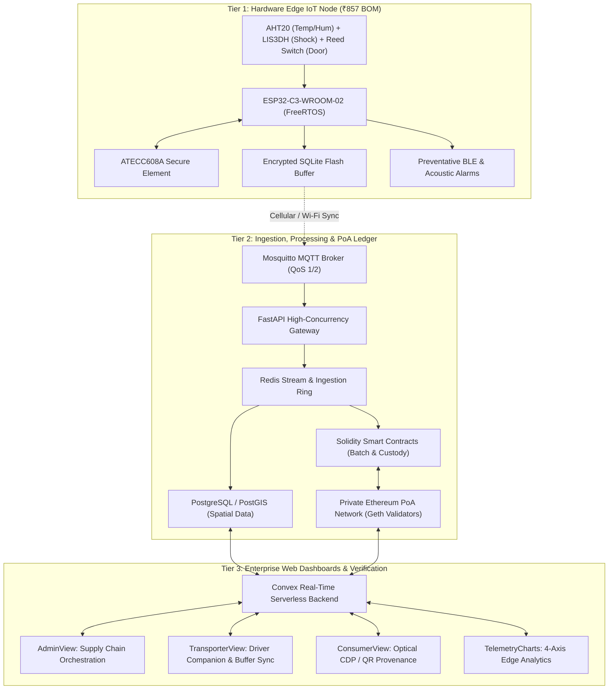

<div align="center">

# 🛡️ TRACE-GUARD

### **Decentralized Cold-Chain Integrity Platform for Farm-to-Fork Traceability**

[](https://www.sih.gov.in/)
[](https://www.sih.gov.in/)
[](https://ethereum.org/)
[](https://www.espressif.com/)
[](https://react.dev/)
[](LICENSE)

<p align="center">
  <strong>Built with precision by Team TORCHBEARERS</strong><br>
  <em>Theme: Transportation & Logistics • Category: Software & Edge Systems</em>
</p>

---

</div>

## 📌 Executive Summary

**Trace-Guard** is an industrial-grade, decentralized cold-chain telemetry and chain-of-custody platform engineered to eliminate cargo spoilage and provenance fraud across farm-to-fork supply networks. Combining ultra-low-cost (₹857) cryptographic edge IoT nodes with a zero-gas private Ethereum Proof-of-Authority (PoA) ledger and offline biometric verification, Trace-Guard guarantees non-repudiable data integrity even across complete cellular dead zones.

---

## ⚡ The Problem vs. The Trace-Guard Solution

```
┌───────────────────────────────────────────────┐      ┌───────────────────────────────────────────────┐
│           CONVENTIONAL COLD CHAINS            │      │              TRACE-GUARD PLATFORM             │
├───────────────────────────────────────────────┤      ├───────────────────────────────────────────────┤
│ ❌ ₹8,000+ proprietary trackers + SIM fees    │  VS  │ ✅ ₹857 edge node BOM; zero ongoing ledger gas│
│ ❌ Vulnerable plain-text logs buffered offline│      │ ✅ ATECC608A hardware-signed SQLite ring-buff │
│ ❌ Static QR codes cloned via photocopying    │      │ ✅ Micro-patterned Anti-Cloning CDPs / NFC    │
│ ❌ Cloud-dependent handoffs fail in dead zones│      │ ✅ On-device TFLite facial biometric custody  │
│ ❌ Post-mortem excursion logging (waste occurs│      │ ✅ Preventative BLE & acoustic edge alerts    │
└───────────────────────────────────────────────┘      └───────────────────────────────────────────────┘
```

### Critical Industry Bottlenecks Addressed
1. **Prohibitive Hardware & Operational Expenditure:** Standard reefer telematics and satellite data-loggers cost between ₹5,000 and ₹15,000 per unit, imposing high barrier-to-entry fees that exclude Indian MSMEs and agricultural cooperatives.
2. **Cloud-Sync Manipulation Attack Surface:** Legacy loggers store unencrypted sensor histories locally. Rogue transporters alter local storage before synchronization to conceal refrigeration shutoffs, preserving haul fees while delivering degraded produce.
3. **Physical-Digital Identity Disconnect:** Standard GS1 barcodes and static QR tags are vulnerable to high-resolution photocopying and fraudulent re-application onto expired, counterfeit, or untracked cargo.
4. **Passive Excursion Logging:** Traditional loggers notify cloud consoles hours after excursion limits have been breached. By the time depot managers receive notification, temperature abuse has caused irreversible enzymatic spoilage.

### The Trace-Guard Paradigm
Trace-Guard re-architects cold-chain logistics through an **offline-first cryptographic pipeline**. Telemetry is signed at the silicon level, buffered securely in encrypted on-chip storage during network blackouts, synchronized automatically with high-throughput brokers upon reconnection, and sealed immutably onto a zero-gas private Ethereum PoA ledger.

---

## 🌟 Core Enterprise Features

* 🔏 **Anti-Cloning Cryptoglyphic Detection Prints (CDP):** Physical cartons and crates are provisioned with micro-patterned tags combining high-density matrix barcodes with sub-pixel steganographic cryptoglyphs. High-resolution photocopiers degrade these high-frequency micro-dots, enabling the consumer web portal to instantly distinguish original tags from unauthorized duplicates using standard mobile camera optics.
* 👤 **Offline Biometric Custody Handoffs:** Custody transfers execute seamlessly in remote packing stations or mountain passes lacking cellular connectivity. Drivers and warehouse managers authenticate via on-device TensorFlow Lite (TFLite) facial verification running locally on the driver application, generating an ECDSA-signed custody payload committed to the consortium chain upon reconnection.
* 🚨 **Preventative Edge Audio & BLE Alerts:** Rather than serving as passive data loggers, the ESP32-C3 edge nodes run active drift-detection algorithms on FreeRTOS. When ambient trends project a thermal violation within 15 minutes, local acoustic buzzers and BLE broadcasts alert the driver immediately, enabling reefer adjustments before spoilage occurs.
* 📦 **Cryptographic Edge Buffering:** Operating in cellular blackouts, sensor frames are signed by an onboard Microchip ATECC608A cryptographic secure element and committed to an encrypted local SQLite FIFO ring buffer. When cellular or depot Wi-Fi resumes, payloads flush via Mosquitto MQTT (QoS 1/2) with deterministic replay verification.
* ⛓️ **Zero-Gas Private Ethereum (Geth) PoA Ledger:** Consortium nodes (cooperatives, port authorities, logistics aggregators, and regulatory bodies like APEDA/FSSAI) validate blocks on a private Geth clique network. This architecture guarantees zero transaction fees, high TPS, deterministic finality, and off-chain raw telemetry storage with on-chain cryptographic state anchors.
* 📊 **Multi-Stakeholder Real-Time Console:** Unified portal providing tailored visibility: real-time reefer route mapping for enterprise admins, offline buffer monitors for freight drivers, and instant provenance verification for consumers.

---

## 🏛️ System Architecture

Trace-Guard implements a high-throughput, three-tier architecture engineered for continuous operational availability:



### Architectural Breakdown

1. **Hardware Edge Tier:**
   * **Compute:** ESP32-C3 single-core RISC-V microcontroller operating under FreeRTOS with power-optimized tickless idle cycles.
   * **Sensor Fusion:** I²C bus polling of AHT20 (±0.3°C, ±2% RH) and LIS3DH (3-axis acceleration up to ±16g for transit drops), supplemented by GPIO interrupts from magnetic reed switches monitoring cargo door openings.
   * **Hardware Security:** ATECC608A hardware cryptographic co-processor stores private keys in hardware-isolated EEPROM, producing NIST P-256 ECDSA signatures over each sensor frame.
   * **Resilience:** Power loss protected; buffered SQLite storage guarantees zero frame drops over continuous multi-day network blackouts.

2. **Ingestion & Consortium Ledger Tier:**
   * **Data Ingestion:** Eclipse Mosquitto broker running over TLS terminating MQTT packets with QoS 1/2 delivery guarantees.
   * **API Services:** Python FastAPI async gateway parsing binary payloads, verifying hardware signatures against registered public keys.
   * **Consortium Blockchain:** Multi-node private Ethereum network running the Clique PoA consensus engine. Zero gas-price configuration (`--miner.gasprice 0`) allows consortium members to commit anchors and state transitions at zero operational cost without volatile gas dynamics.

3. **Application & Dashboard Tier:**
   * **Real-Time Synchronization:** Convex serverless backend powers bi-directional data flow, syncing edge telemetry updates and chain events directly to client interfaces without polling latency.
   * **Role-Based Visualization:** Tailored front-ends built with React 19, Vite, Radix UI, Framer Motion, and Tailwind CSS.

---

## 🛠️ Complete Technology Stack

| Category | Technology | Version / Specification | Role in Trace-Guard |
| :--- | :--- | :--- | :--- |
| **Frontend Framework** | **React** | `v19.2.0` | High-performance reactive UI rendering |
| **Build & Tooling** | **Vite** | `v7.2.6` | Sub-second HMR and production bundle pipeline |
| **Real-Time Data Layer** | **Convex** | `v1.46.0` | Reactive serverless backend, schema validation, mutations |
| **Component Primitives** | **Radix UI** | Complete Suite | WAI-ARIA compliant accessible UI primitives |
| **Styling & Design** | **Tailwind CSS** | `v4.1.17` | Utility-first industrial dark-mode interface system |
| **Animations** | **Framer Motion** | `v12.23.25` | Fluid state transitions, drawer mechanics, telemetry updates |
| **Time-Series Charts** | **Recharts** | `v2.15.4` | Responsive 4-axis environmental telemetry charts |
| **Optical Vision** | **jsQR** | `v1.4.0` | In-browser real-time CDP & QR code decoding |
| **Edge Compute** | **ESP32-C3-WROOM-02** | 160MHz RISC-V, 4MB Flash | Edge node processing and sensor multiplexing |
| **Edge RTOS** | **FreeRTOS** | Real-Time Microkernel | Deterministic task scheduling, power management, BLE |
| **Hardware Security** | **Microchip ATECC608A** | Secure Element (I²C) | Silicon-grade key storage & ECDSA signature generation |
| **Sensors** | **AHT20 + LIS3DH + Reed** | Industrial-Grade | Temperature, humidity, 3-axis shock, and door state |
| **Edge Storage** | **SQLite (Encrypted)** | Flash Ring Buffer | Offline local persistence of signed telemetry records |
| **Ingestion Broker** | **Eclipse Mosquitto** | MQTT v5 / QoS 1/2 | Low-overhead field telemetry transport over cellular |
| **API Gateway** | **FastAPI** | Python 3.11+ / AsyncIO | High-concurrency payload verification & ledger dispatch |
| **Ledger Network** | **Go-Ethereum (Geth)** | Clique PoA Private Net | Consortium immutability, zero-gas execution |
| **Smart Contracts** | **Solidity** | `^0.8.24` | Batch registration, telemetry anchoring, custody handoffs |

---

## 💻 Hardware Bill of Materials (BOM)

Trace-Guard was engineered from first principles to break the affordability barrier, achieving a total bill of materials cost of **₹857** for a fully sealed, field-ready edge unit:

| Component | Part / Spec | Functionality | Unit Cost (INR) |
| :--- | :--- | :--- | :--- |
| **Microcontroller** | ESP32-C3-WROOM-02 (4MB) | RISC-V SoC, 2.4GHz Wi-Fi + BLE 5.0 | ₹195 |
| **Environmental Sensor** | AHT20 Module | High-precision temperature (±0.3°C) & humidity (±2%) | ₹95 |
| **Shock / Drop Sensor** | LIS3DH Accelerometer | 3-axis motion tracking, threshold interrupts (±16g) | ₹145 |
| **Intrusion Sensor** | Magnetic Reed Switch | Tamper & cargo door intrusion detection | ₹22 |
| **Hardware Secure Element**| Microchip ATECC608A | NIST P-256 ECDSA silicon key-signing & crypto storage | ₹165 |
| **Power & Regulation** | TP4056 + 18650 Li-Ion Cell | 2600mAh rechargeable cell with BMS circuit | ₹155 |
| **Enclosure & Connectors** | Custom IP65 Sealed Housing | Weather-proof, anti-vibration shock mount | ₹80 |
| **Total BOM Cost** | — | **Industrial-Grade Edge Telematics Unit** | **₹857** |

---

## 🖥️ Repository Structure & Role-Based Workspaces

The repository contains the complete frontend dashboard application, state machine, and real-time backend synchronization:

```
traceguard/
├── .env.example                # Canonical template for environment configurations
├── components.json             # Shadcn / Radix component configuration
├── convex.json                 # Convex cloud and local orchestration settings
├── package.json                # Project dependencies and script declarations
├── vite.config.ts              # Vite bundler plugins and path aliases (@/*)
├── public/                     # Public static assets, brand marks, and fonts
└── src/
    ├── App.tsx                 # Root application wrapper with routing providers
    ├── main.tsx                # Client bootstrapping and DOM mounting
    ├── index.css               # Global Tailwind CSS tokens and themes
    ├── components/
    │   └── ui/                 # 40+ atomic Radix UI primitives:
    │                           # dialog, tabs, badge, card, dropdown-menu, etc.
    ├── console/
    │   ├── OperationsConsole.tsx   # Master console with deep-linking & live node counters
    │   ├── AdminView.tsx           # Global supply chain orchestration & ledger feed
    │   ├── TransporterView.tsx     # Driver HUD: offline buffer toggle & biometric scanner
    │   ├── ConsumerView.tsx        # Consumer mobile scanner, camera stream & CDP analysis
    │   └── TelemetryCharts.tsx     # Multi-metric time-series visualizer (Temp/RH/Shock/Doors)
    ├── convex/
    │   ├── schema.ts           # Strict Convex table definitions and relations
    │   ├── auth.ts             # Authentication endpoints and session management
    │   ├── users.ts            # Enterprise user directory mutations and queries
    │   └── auth/
    │       └── emailOtp.ts     # Cryptographic one-time password auth verification
    ├── lib/
    │   ├── trace-data.ts       # Consortium ledger data structures and telemetry types
    │   └── utils.ts            # Class merging (clsx + tailwind-merge) utilities
    └── pages/
        ├── Landing.tsx         # Executive portal overview & architectural briefing
        ├── Dashboard.tsx       # Operator entry router
        ├── BatchDetail.tsx     # Deep-dive batch provenance and block inspector
        ├── WorkspaceDashboard.tsx # Supply chain partner overview
        └── Auth.tsx            # Multi-stakeholder role authentication portal
```

### Deep-Dive: Console Modules

* **`AdminView.tsx` (Supply Chain Orchestration):**
  Provides enterprise logistics controllers with real-time fleet visibility across active transit corridors (e.g., Ratnagiri–Mumbai, Sopore–Delhi). Features interactive geographic transport arcs, dynamic risk scoring, live Geth PoA transaction tickers, and drill-down telemetry inspectors.
* **`TransporterView.tsx` (Driver & Fleet Companion):**
  Emulates an in-cab rugged mobile terminal. Demonstrates **offline resilience** via a live simulated network toggle. When connectivity drops, sensor payloads automatically divert to an edge buffer count. Upon reconnection, an automated flush synchronizes the backlog with the chain. Features a 4-step on-device biometric handoff simulator.
* **`ConsumerView.tsx` (Optical Provenance & Anti-Cloning Verifier):**
  A smartphone-optimized scanning interface leveraging device camera video feeds and `jsQR` decoding. Beyond standard payload validation, it runs optical checks to detect photocopy-degraded cryptoglyphs, exposing counterfeits while rendering complete farm-to-fork origin and QA verification timelines for authentic batches.
* **`OperationsConsole.tsx` & `TelemetryCharts.tsx`:**
  The centralized routing harness featuring real-time node count telemetry (342/348 online), PoA block confirmations, and four-dimensional charting (Temperature, Humidity, Shock, and Door Breach events) against regulatory compliance thresholds.

---

## 🚀 Local Deployment Guide

Follow these steps to deploy and run the complete Trace-Guard web console and real-time backend locally.

### Prerequisites
* **Node.js:** `v18.0.0` or higher (v20+ recommended)
* **Package Manager:** `npm` (v9+) or `bun` (v1+)
* **Browser:** Any modern Chromium, Firefox, or WebKit browser with WebRTC/Camera permissions enabled for CDP scanning

### 1. Clone the Repository
```bash
git clone https://github.com/bakshivaishvik/sih26232-torchbearers.git
cd sih26232-torchbearers
```

### 2. Install Dependencies
```bash
npm install
# or if using bun:
bun install
```

### 3. Configure Environment Variables
Copy the template `.env.example` into a local configuration file:
```bash
cp .env.example .env.local
```

Ensure your `.env.local` contains the appropriate endpoints:
```env
# Convex deployment URL (generated automatically upon running npx convex dev)
VITE_CONVEX_URL=https://your-convex-deployment.convex.cloud

# Local authentication callback
CONVEX_SITE_URL=http://localhost:5173

# Optional: Dedicated deployment identifier
CONVEX_DEPLOYMENT=dev:your-deployment-name
```

### 4. Initialize the Convex Real-Time Backend
Start the Convex synchronization process in your development environment:
```bash
npx convex dev
```
*(On first run, this command will prompt you to authenticate or create a free project, automatically setting `VITE_CONVEX_URL` in your `.env.local` file).*

### 5. Launch the Development Server
In a separate terminal tab, launch the Vite development server:
```bash
npm run dev
```

The application will be live at:
```
http://localhost:5173
```

Navigate to:
* **Master Operations Console:** `http://localhost:5173/console`
* **Admin Supply Chain View:** `http://localhost:5173/console?view=admin`
* **Transporter In-Cab HUD:** `http://localhost:5173/console?view=transporter`
* **Consumer Verification:** `http://localhost:5173/console?view=consumer`

### 6. Production Compilation & Verification
To test production builds with type safety checks and tree-shaking:
```bash
npm run build
npm run preview
```

---

## 👥 Team TORCHBEARERS — Smart India Hackathon 2026

* **Vaishvik Bakshi** — Systems Architecture, Cryptographic Pipelines & Ledger Infrastructure
* **Team TORCHBEARERS Engineers** — Embedded Firmware (FreeRTOS/ESP32), Distributed Systems, and Enterprise UX

---

## 📄 License & Regulatory Compliance

Distributed under the **Apache License 2.0**. See [`LICENSE`](LICENSE) for detailed terms.

Trace-Guard telemetry data structures, thermal excursion definitions, and chain-of-custody audits are aligned with guidelines established by:
* **APEDA** (Agricultural and Processed Food Products Export Development Authority) — Organic agricultural export compliance.
* **FSSAI** (Food Safety and Standards Authority of India) — Schedule 4 sanitary and cold-chain transport regulations.

